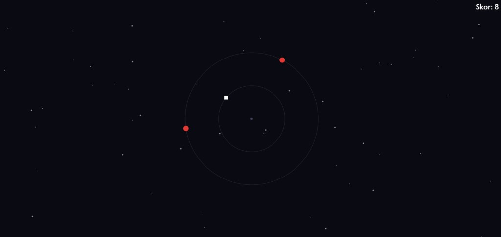
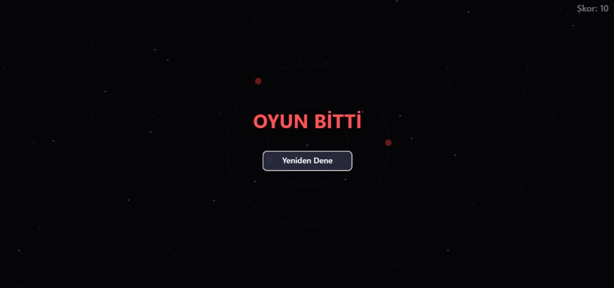

Yorungede Gezmece #

2D, tek sayfa HTML5 Canvas oyunu. Merkez etrafında dönen oyuncu, **Space** ile iç / dış yörünge arasında geçer; kırmızı engellere çarpmamaya çalışır. Skor, hayatta kalınan süre (saniye) ile ölçülür.

**Canlı oyun (GitHub Pages): 
https://hyigitgunay.github.io/Like-Orbital-Game/

---

## Orijinal oyun / esinlenme

Bu proje, yörünge ve engellerden kaçınma fikrini aşağıdaki oyundan **esinlenerek**; **saf JavaScript** ve **HTML5 `<canvas>`** ile sıfırdan kodlanmıştır (Unity / oyun motoru kullanılmamıştır).

- **Referans oyun:** [Orbital v2.3.2](https://jamiemcclenaghan.itch.io/orbital) — Jamie McClenaghan (itch.io)

---

## Nasıl oynanır

| Girdi | İşlev |
|--------|--------|
| **Başlat** (tık) | İlk etkileşim; müzik / ses kilidini açar, oyunu başlatır. |
| **Space** (basılı) | Dış yörüngeye geç (yörünge değiştir). |
| **Space** (bırak) | İç yörüngeye dön. |
| **Yeniden Dene** (tık) | Oyun bittikten sonra yeniden başlat. |

**Amaç:**  Zaman ilerledikçe oyun hafifçe zorlaşır.Oyuncunun başlangıçta 3 canı vardır. Kırmızı engellere çarpıldığında bir can kaybedilir. Can sıfıra düştüğünde oyun biter.

Oyun sırasında sarı bonus objeleri oluşur. Oyuncu bu bonusları topladığında skoruna ek puan kazanır.

---

## Yerel çalıştırma

1. Depoyu klonlayın veya `index.html` dosyasını alın.  
2. `ses/` klasörüne aşağıdaki isimlerle **.wav** dosyalarını koyun (Freesound’dan indirip adlandırın):
   - `muzik.wav` — arka plan müziği (döngü)
   - `yorunge.wav` — yörünge değişim SFX
   - `yanma.wav` — çarpışma SFX  
3. `index.html` dosyasını tarayıcıda açın veya basit bir statik sunucu kullanın.

---

## Ekran görüntüleri

---

## Proje yapısı (özet)

- `index.html` — oyun, stil ve betik (tek sayfa)
- `gorseller/` — README için oyun ekran görüntüleri
- `ses/` — müzik ve ses efektleri (.wav)
- `AI.md` — yapay zekâ kullanım bildirimi

---

## Atıf ve krediler (ses)

Tüm sesler [Freesound](https://freesound.org) üzerinden **Creative Commons 0 (CC0)** lisansıyla kullanılmıştır; README rubriğinde istenen kredi aşağıdadır.

| Dosya (projede) | Kaynak |
|-----------------|--------|
| `ses/yorunge.wav` | [SFX_Jump_39.wav — jalastram](https://freesound.org/people/jalastram/sounds/386658/) |
| `ses/yanma.wav` | [8-bit explosion ARP — hotpin7](https://freesound.org/people/hotpin7/sounds/818672/) |
| `ses/muzik.wav` | [8 bit game loop 006 only organ long 120 bpm.wav — josefpres](https://freesound.org/people/josefpres/sounds/655190/) |

İndirdikten sonra dosyaları sırasıyla `yorunge.wav`, `yanma.wav`, `muzik.wav` olarak `ses/` içine koyun.

---
